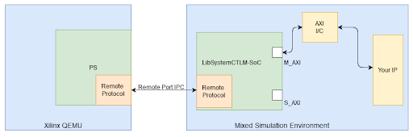

# Bachelor's thesis(minor project) An Implementation of H.264 Video Codec

Note: This is just a minor project carrying 3 credits. Kindly wait for our update on our major Bachelor's thesis.

## Contents
- Aim and Objective
- Flow Diagram
- Work Progress
- Intra Prediction
- Transform Coding
- Integer Motion Estimation (IME)
- Fractional Motion Estimation (FME)
- Motion Compensation
- Integration Testing
- Summary
- References

## Objective
To design and implement a H.264 video encoder using Verilog HDL.

## Flow Diagram

## Work Plan

## Intra Prediction

## Transform Coding

## Integer Motion Estimation (IME)

##Fractional Motion Estimation (FME)

##Integration Testing

## Comparison

##Simulation flow results

##Parameters (for 720p encodes)
Parameter | X264 White paper|Presented model|Percentage Improvement|Unit
 -----|------|------|-------
 VMAF(Video Multi-Method Assessment Fusion) |82.19|85.46|4%|Unitless
PSNR |33.74|39.65|17%|dB
Clock cycles|75001|69750|7%|Unitless
Bitrate|3896|4003|27%|bps

##Results and Future Work
###Results:
- Overall improvement in clock cycle and PSNR.
- Analysed how quantisation parameter affects the quality of reconstructed image quality.

###Future Work:
- To integrate intra-loop into the co-simulation flow.
- To integrate intra- and inter-loop into the FPGA flow.
- To optimise blocks further.

## References
- Richardson, Iain. The H.264 Advanced Video Compression Standard: Second Edition. Wiley Publications, April 2010, 10.1002/9780470989418. 
- Lin, Youn-Long & Kao, Chao-Yang & Kuo, Hung-Chih & Chen, Jian-Wen. “VLSI design for video coding. H.264/AVC encoding from standard specification to chip”, Springer Publications, January 2010 10.1007/978-1-4419-0959-6. 
-  Amer, W. Badawy and G. Jullien, "Towards MPEG-4 part 10 system on chip: a VLSI prototype for context-based adaptive variable length coding (CAVLC)," IEEE Workshop on Signal Processing Systems, 2004. SIPS 2004., 2004, pp. 275-279, doi: 10.1109/SIPS.2004.1363062.
- G. Mahfoudi, F. Retraint, F. Morain-Nicolier and M. M. Pic, "Statistical H.264 Double Compression Detection Method Based on DCT Coefficients," in IEEE Access, vol. 10, pp. 4271-4283, 2022, doi: 10.1109/ACCESS.2022.3140588.
-  El-Mowafy, S.M. Gharghory, M.A. Abo-Elsoud, M. Obayya, M.I. Fath Allah, “Efficient mode decision scheme based on edge detection with Gaussian pulse for Intra-prediction in H.264/AVC”,Alexandria Engineering Journal, Volume 61, Issue 4, 2022, Pages 2709-2722, ISSN 1110-0168, https://doi.org/10.1016/j.aej.2021.07.044.
- Shreyanka Subbarayappa and K R Rao, “Video quality evaluation and testing verification of H.264, HEVC, VVC and EVC video compression standards”, IOP Conference Series: Materials Science and Engineering, vol. 1045, pp. 12-28, Feb 2021, doi: 10.1088/1757-899X/1045/1/012028
- R. Miguélez-Tercero, A. Jiménez-Ruiz, D. Ruiz-Coll, G. Fernández-Escribano and P. Cuenca, "Analysis of the Capabilities of Embedded Systems in Intraprediction Video Coding," in IEEE Consumer Electronics Magazine, vol. 11, no. 5, pp. 25-40, 1 Sept. 2022, doi: 10.1109/MCE.2021.3084817
